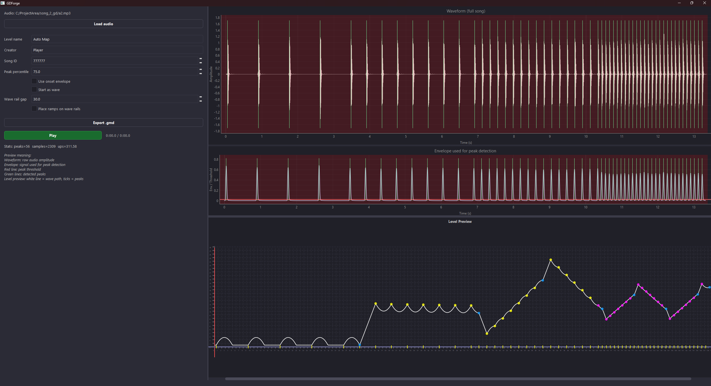
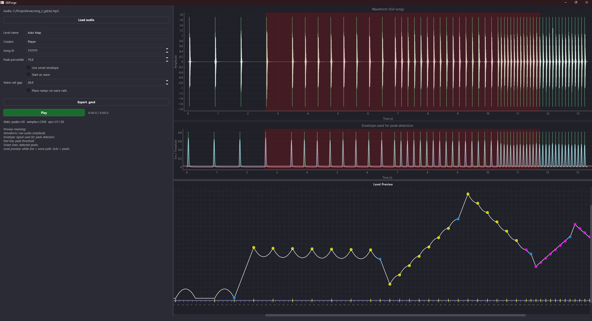
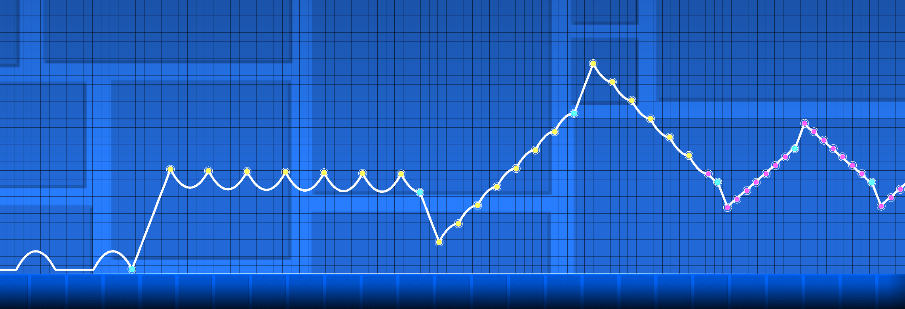
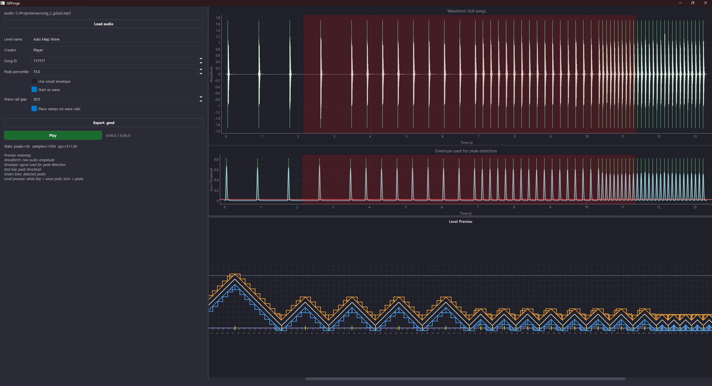
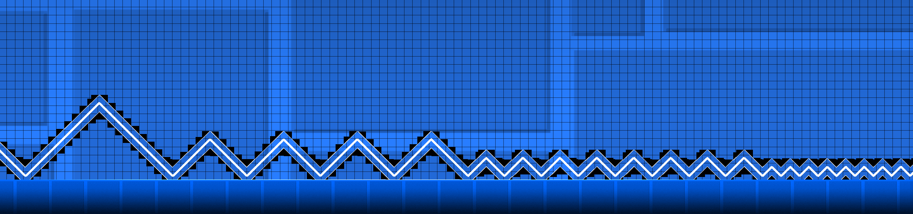

# GDForge

A tool that takes a song and generates a playable Geometry Dash level from it. It analyzes the audio, detects beats, and simulates the player physics across those beats. The output is a `.gmd` file you can import with GDShare.



## How it works

### Audio analysis

The audio is loaded and an envelope is computed over the signal, either RMS amplitude or onset strength. Peaks in that envelope are the beats. They are detected using a dynamic percentile threshold with a minimum separation, and those timestamps drive everything downstream.

| Parameter | Default |
|---|---|
| Hop length | 256 samples |
| Peak percentile threshold | 75.0 |
| Minimum peak separation | 90 ms |

### Cube mode

In cube mode the player follows ballistic arcs between orb hits. The physics constants match observed in-game behavior.

| Constant | Value |
|---|---|
| Gravity | 2727.35 units/s² |
| Yellow orb impulse | 590.85 units/s |
| Pink orb impulse | 418.50 units/s |
| Velocity cap angle | 69° |
| Base speed | 311.58 units/s |

Orb types are assigned based on beat intervals. Short gaps get pink orbs, long gaps get yellow. Blue orbs are inserted periodically to keep the player from drifting to the floor or ceiling over time. A multi-pass floor safety corrector then walks the sequence and downgrades any orb that would send the player into the ground.

If the song continues past the last detected beat, the orb sequence is extended at the median beat interval until the audio ends.

### Wave mode

The path moves diagonally at 45 degrees inside a height corridor, switching direction at each beat. Rail clones are placed above and below the main path at a configurable gap, with ramps spaced along each rail by arc length and rotated to match the path tangent. 1 unit = 30 pixels in GD's coordinate system.

| Parameter | Default |
|---|---|
| Corridor height | 10 blocks (300 units) |
| Wall margin | 0.5 units |
| Rail gap | 30.0 units |
| Ramp size | 30.0 units |

### Object placement

Blocks are placed by arc-length sampling rather than by time. Cumulative path length is computed and sampled at uniform 4-unit intervals, which keeps block density visually consistent regardless of how steep the path is at any point.

The exported format is GD's plain object string: `1,<id>,2,<x>,3,<y>,6,<rot>,155,1;` for every object, wrapped in a color/speed header and GD's plist envelope. This format was reverse-engineered from `.gmd` files exported with the [GDShare](https://github.com/GDColon/GDShare) mod. On export, the song file is copied to `%localappdata%\GeometryDash\<song_id>.mp3` and linked to the level automatically, so it plays in GD without any manual setup. The song ID can be set in the app before exporting.

**Object IDs:**

| Object | ID |
|---|---|
| Path block | 1764 |
| Wave portal | 660 |
| Yellow orb | 36 |
| Pink orb | 141 |
| Blue orb | 84 |
| Cube portal | 12 |
| Ramp | 309 |

## GUI

The interface has two panels: an audio view showing the waveform and envelope with beat markers, and a level geometry preview. Both share a playhead and you can double-click anywhere on either to seek. Scrolling or zooming the level preview highlights the corresponding region in the audio plots.

Parameter changes are debounced 300 ms before regenerating. Audio analysis runs in a background thread and posts results back to the UI via a Qt signal.

### Cube mode





### Wave mode





## Installation

**Windows only.** The export copies the song file to GD's local data folder, which is Windows-specific.

Python 3.8.10

```bash
git clone https://github.com/hannesgook/gdforge.git
cd GDForge
pip install -r requirements.txt
python app.py
```

## Usage

1. Load a song (.mp3, .wav, .ogg, .flac)
2. Adjust Peak percentile to taste. Higher means fewer peaks, only the strongest hits
3. Onset envelope works better for percussive tracks
4. Toggle Start as wave to switch between cube arc and wave mode
5. Set the song ID to an unused custom song slot in GD
6. Export .gmd. The song is copied to GD's local data folder and linked to the level automatically
7. Import the .gmd using [GDShare](https://github.com/GDColon/GDShare)

## Repository structure

```text
GDForge/
├── app.py            # GUI, playback, export
├── generator.py      # Arc simulation, wave path, orb sequencing
├── audio_analysis.py # Envelope computation, peak detection
├── gd_serialize.py   # k4 string builder, XML serializer, ramp placement
├── settings.py       # Parameters as dataclasses
└── docs/             # Images
```

## License

MIT License, Copyright (c) 2025-2026 Hannes Göök. Not affiliated with or endorsed by RobTop Games.